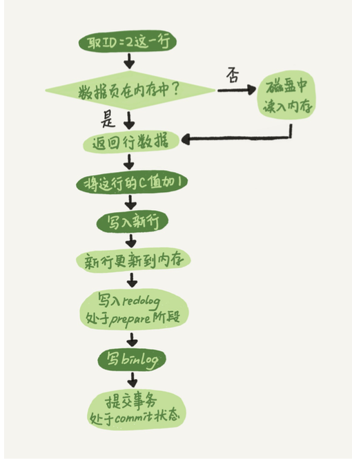

## 字符集

`MySQL` 字符编码集中有两套 `UTF-8` 编码实现：`utf8` 和 `utf8mb4`。

如果使用 `utf8` 的话，存储 `emoji` 符号和一些比较复杂的汉字、繁体字就会出错。

常见的字符集有 ASCII、GB2312、GBK、UTF-8......。

不同的字符集的主要**区别**在于：

- 可以表示的字符范围
- 编码方式

`MySQL` 字符编码集中有两套 `UTF-8` 编码实现：

- `utf8` ： utf8编码只支持1-3个字节 。 在 utf8 编码中，中文是占 3 个字节，其他数字、英文、符号占一个字节。但 emoji 符号占 4 个字节，一些较复杂的文字、繁体字也是 4 个字节。
- `utf8mb4` ： UTF-8 的完整实现，正版！最多支持使用 4 个字节表示字符，因此，可以用来存储 emoji 符号。

为什么有两套 UTF-8 编码实现呢？ 原因如下：


因此，如果你需要存储emoji类型的数据或者一些比较复杂的文字、繁体字到 MySQL 数据库的话，数据库的编码一定要指定为utf8mb4 而不是utf8 ，要不然存储的时候就会报错了。

## MySQL 基础结构

执行一条 `SQL`，在 `MySQL` 的过程？


- 连接器： 身份认证和权限相关(登录 MySQL 的时候)。
- 查询缓存： 执行查询语句的时候，会先查询缓存（MySQL 8.0 版本后移除，因为这个功能不太实用）。
- 分析器： 没有命中缓存的话，SQL 语句就会经过分析器，分析器说白了就是要先看你的 SQL 语句要干嘛，再检查你的 SQL 语句语法是否正确。
- 优化器： 按照 MySQL 认为最优的方案去执行。
- 执行器： 执行语句，然后从存储引擎返回数据。 执行语句之前会先判断是否有权限，如果没有权限的话，就会报错。
- 插件式存储引擎 ： 主要负责数据的存储和读取，采用的是插件式架构，支持 InnoDB、MyISAM、Memory 等多种存储引擎。

## MySQL 存储引擎架构了解吗？

MySQL 存储引擎采用的是插件式架构，支持多种存储引擎，我们甚至可以为不同的数据库表设置不同的存储引擎以适应不同场景的需要。存储引擎是基于表的，而不是数据库。

并且，你还可以根据 MySQL 定义的存储引擎实现标准接口来编写一个属于自己的存储引擎。这些非官方提供的存储引擎可以称为第三方存储引擎，区别于官方存储引擎。像目前最常用的 InnoDB 其实刚开始就是一个第三方存储引擎，后面由于过于优秀，其被 Oracle 直接收购了。

## MyISAM 和 InnoDB 的区别是什么？

`MyISAM` 不支持事务和行级锁，而且最大的缺陷就是崩溃后无法安全恢复。

1. 是否支持行级锁

    MyISAM 只有表级锁(table-level locking)，而 InnoDB 支持行级锁(row-level locking)和表级锁,默认为行级锁。

2. 是否支持事务

    MyISAM 不提供事务支持。

    InnoDB 提供事务支持，实现了 SQL 标准定义了四个隔离级别，具有提交(commit)和回滚(rollback)事务的能力。并且，InnoDB 默认使用的 REPEATABLE-READ（可重读）隔离级别是可以解决幻读问题发生的（基于 MVCC 和 Next-Key Lock）。

3. 是否支持外键

    MyISAM 不支持，而 InnoDB 支持。

    外键对于维护数据一致性非常有帮助，但是对性能有一定的损耗。因此，通常情况下，我们是不建议在实际生产项目中使用外键的，在业务代码中进行约束即可！

4. 是否支持数据库异常崩溃后的安全恢复

    MyISAM 不支持，而 InnoDB 支持。

    使用 InnoDB 的数据库在异常崩溃后，数据库重新启动的时候会保证数据库恢复到崩溃前的状态。这个恢复的过程依赖于 redo log 。

5. 是否支持 MVCC

    MyISAM 不支持，而 InnoDB 支持。

    毕竟 MyISAM 连行级锁都不支持。MVCC 可以看作是行级锁的一个升级，可以有效减少加锁操作，提高性能。

6. 索引实现不一样。

    虽然 MyISAM 引擎和 InnoDB 引擎都是使用 B+Tree 作为索引结构，但是两者的实现方式不太一样。

    InnoDB 引擎中，其数据文件本身就是索引文件。相比 MyISAM，索引文件和数据文件是分离的，其表数据文件本身就是按 B+Tree 组织的一个索引结构，树的叶节点 data 域保存了完整的数据记录。

## MySQL 锁

### 表级锁和行级锁了解吗？有什么区别？

MyISAM 仅仅支持表级锁(table-level locking)，一锁就锁整张表，这在并发写的情况下性非常差。

InnoDB 不光支持表级锁(table-level locking)，还支持行级锁(row-level locking)，默认为行级锁。行级锁的粒度更小，仅对相关的记录上锁即可（对一行或者多行记录加锁），所以对于并发写入操作来说， InnoDB 的性能更高。

表级锁和行级锁对比 ：

- 表级锁： MySQL 中锁定粒度最大的一种锁，是针对非索引字段加的锁，对当前操作的整张表加锁，实现简单，**资源消耗也比较少，加锁快，不会出现死锁。其锁定粒度最大，触发锁冲突的概率最高，并发度最低**，MyISAM 和 InnoDB 引擎都支持表级锁。

- 行级锁： MySQL 中锁定粒度最小的一种锁，是针对索引字段加的锁，只针对当前操作的行记录进行加锁。 行级锁能大大减少数据库操作的冲突。**其加锁粒度最小，并发度高，但加锁的开销也最大，加锁慢，会出现死锁。**

### 行级锁的使用有什么注意事项？

**InnoDB 的行锁是针对索引字段加的锁**，表级锁是针对非索引字段加的锁。**当我们执行 UPDATE、DELETE 语句时，如果 WHERE 条件中字段没有命中唯一索引或者索引失效的话，就会导致扫描全表对表中的所有行记录进行加锁。**

不过，很多时候即使用了索引也有可能会走全表扫描，这是因为 MySQL 优化器的原因。

### 共享锁和排他锁呢？

不论是表级锁还是行级锁，都存在共享锁（Share Lock，S 锁）和排他锁（Exclusive Lock，X 锁）这两类：

**共享锁（S 锁）** ：又称**读锁**，事务在读取记录的时候获取共享锁，允许多个事务同时获取（锁兼容）。

**排他锁（X 锁）** ：又称**写锁/独占锁**，事务在修改记录的时候获取排他锁，不允许多个事务同时获取。如果一个记录已经被加了排他锁，那其他事务不能再对这条事务加任何类型的锁（锁不兼容）。

**排他锁与任何的锁都不兼容，共享锁仅和共享锁兼容。**

### InnoDB 有哪几类行锁？

MySQL InnoDB 支持三种行锁定方式：

- 记录锁（Record Lock） ：也被称为记录锁，行锁，属于单个行记录上的锁。
- 间隙锁（Gap Lock） ：锁定一个范围，不包括记录本身。
- 临键锁（Next-key Lock） ：Record Lock+Gap Lock，锁定一个范围，包含记录本身。记录锁只能锁住已经存在的记录，为了避免插入新记录，需要依赖间隙锁。
InnoDB 的默认隔离级别 RR（可重读）是可以解决幻读问题发生的，主要有下面两种情况：

  - 快照读（一致性非锁定读） ：由 MVCC 机制来保证不出现幻读。
  - 当前读 （一致性锁定读）： 使用 Next-Key Lock 进行加锁来保证不出现幻读。

## 索引

### 索引的优缺点

- 优点 ：

使用索引可以大大加快数据的检索速度（大大减少检索的数据量）, 这也是创建索引的最主要的原因。
通过创建唯一性索引，可以保证数据库表中每一行数据的唯一性。

- 缺点 ：

创建索引和维护索引需要耗费许多时间。当对表中的数据进行增删改的时候，如果数据有索引，那么索引也需要动态的修改，会降低 SQL 执行效率。
索引需要使用物理文件存储，也会耗费一定空间。

但是，**使用索引一定能提高查询性能吗?**

大多数情况下，索引查询都是比全表扫描要快的。但是如果数据库的数据量不大，那么使用索引也不一定能够带来很大提升。

### MyISAM InnoDB 索引结构实现差异

- MyISAM 引擎中，B+Tree 叶节点的 data 域存放的是数据记录的地址。在索引检索的时候，首先按照 B+Tree 搜索算法搜索索引，如果指定的 Key 存在，则取出其 data 域的值，然后以 data 域的值为地址读取相应的数据记录。这被称为“非聚簇索引”。

- InnoDB 引擎中，其数据文件本身就是索引文件。相比 MyISAM，索引文件和数据文件是分离的，其表数据文件本身就是按 B+Tree 组织的一个索引结构，树的叶节点 data 域保存了完整的数据记录。这个索引的 key 是数据表的主键，因此 InnoDB 表数据文件本身就是主索引。这被称为“聚簇索引（或聚集索引）”，而其余的索引都作为辅助索引，辅助索引的 data 域存储相应记录主键的值而不是地址，这也是和 MyISAM 不同的地方。在根据主索引搜索时，直接找到 key 所在的节点即可取出数据；在根据辅助索引查找时，则需要先取出主键的值，再走一遍主索引。 因此，在设计表的时候，不建议使用过长的字段作为主键，也不建议使用非单调的字段作为主键，这样会造成**主索引频繁分裂**。

### B 树 & B+树两者有何异同呢？

- B 树的所有节点既存放键(key) 也存放 数据(data)，而 B+树只有叶子节点存放 key 和 data，其他内节点只存放 key。
- B 树的叶子节点都是独立的;B+树的叶子节点有一条引用链指向与它相邻的叶子节点。
- B 树的检索的过程相当于对范围内的每个节点的关键字做二分查找，可能还没有到达叶子节点，检索就结束了。而 B+树的检索效率就很稳定了，任何查找都是从根节点到叶子节点的过程，叶子节点的顺序检索很明显。

### 数据结构 （B 树 & B+树）

> 结合 《MySQL 技术内幕》的索引部分看

### 索引类型

#### 主键索引

数据表的主键列使用的就是主键索引。一张数据表有只能有一个主键，并且主键不能为 null，不能重复。

> 在没有主键的表，特定 `GIPK mode` 下会自动生成不可见的主键：
> https://dev.mysql.com/doc/refman/8.0/en/create-table-gipks.html


#### 二级索引（辅助索引）

二级索引又称为辅助索引，是因为二级索引的叶子节点存储的数据是主键。也就是说，通过二级索引，可以定位主键的位置。

**唯一索引，普通索引，前缀索引等索引属于二级索引。**


- 唯一索引(Unique Key) ：唯一索引也是一种约束。唯一索引的属性列不能出现重复的数据，但是允许数据为 NULL，一张表允许创建多个唯一索引。 建立唯一索引的目的大部分时候都是为了该属性列的数据的唯一性，而不是为了查询效率。
- 普通索引(Index) ：普通索引的唯一作用就是为了快速查询数据，一张表允许创建多个普通索引，并允许数据重复和 NULL。
- 前缀索引(Prefix) ：**前缀索引只适用于字符串类型的数据**。前缀索引是对文本的前几个字符创建索引，相比普通索引建立的数据更小， 因为只取前几个字符。
- 全文索引(Full Text) ：全文索引主要是为了检索大文本数据中的关键字的信息，是目前搜索引擎数据库使用的一种技术。Mysql5.6 之前只有 MyISAM 引擎支持全文索引，5.6 之后 InnoDB 也支持了全文索引。

#### 聚集索引与非聚集索引

##### 聚集索引
聚集索引即索引结构和数据一起存放的索引。主键索引属于聚集索引。

在 MySQL 中，InnoDB 引擎的表的 .ibd文件就包含了该表的索引和数据，对于 InnoDB 引擎表来说，该表的索引(B+树)的每个非叶子节点存储索引，叶子节点存储索引和索引对应的数据。

- 聚集索引的优点

聚集索引的查询速度非常的快，因为整个 B+树本身就是一颗多叉平衡树，叶子节点也都是有序的，定位到索引的节点，就相当于定位到了数据。

- 聚集索引的缺点

1. 依赖于有序的数据 ：因为 B+树是多路平衡树，如果索引的数据不是有序的，那么就需要在插入时排序，如果数据是整型还好，否则类似于字符串或 UUID 这种又长又难比较的数据，插入或查找的速度肯定比较慢。
2. 更新代价大 ： 如果对索引列的数据被修改时，那么对应的索引也将会被修改，而且聚集索引的叶子节点还存放着数据，修改代价肯定是较大的，所以**对于主键索引来说，主键一般都是不可被修改的。**

##### 非聚集索引

非聚集索引即索引结构和数据分开存放的索引。

二级索引属于非聚集索引。

非聚集索引的叶子节点并不一定存放数据的指针，因为二级索引的叶子节点就存放的是主键，根据主键再回表查数据。

- 非聚集索引的优点

更新代价比聚集索引要小 。非聚集索引的更新代价就没有聚集索引那么大了，非聚集索引的叶子节点是不存放数据的

- 非聚集索引的缺点

1. 跟聚集索引一样，非聚集索引也依赖于有序的数据
2. 可能会二次查询(回表) :这应该是非聚集索引最大的缺点了。 当查到索引对应的指针或主键后，可能还需要根据指针或主键再到数据文件或表中查询。

##### 非聚集索引一定回表查询吗(覆盖索引)?

非聚集索引不一定回表查询。

```sql
# 试想一种情况，用户准备使用 SQL 查询用户名，而用户名字段正好建立了索引。
 SELECT name FROM table WHERE name='guang19';
# 那么这个索引的 key 本身就是 name，查到对应的 name 直接返回就行了，无需回表查询。
```

即使是 MYISAM 也是这样，虽然 MYISAM 的主键索引确实需要回表， 因为它的主键索引的叶子节点存放的是指针。但是如果 SQL 查的就是主键呢?

```sql
SELECT key2 FROM table WHERE key1=xxx；
SELECT primary key2,key2 FROM table WHERE key1=xxx；
SELECT primary key1,key2 FROM table WHERE key1=xxx；
SELECT primary key1,primary key2，key2 FROM table WHERE key1=xxx；
```

`key1` `key2` 本身就是索引，查到返回就行了。这种情况就称之为**覆盖索引**（即从辅助索引中就可以得到查询的记录，而不需要查询聚集索引中的记录。使用覆盖索引的一个好处是辅助索引不包含整行记录的所有信息，故其大小要远小于聚集索引，因此可以减少大量的IO操作。）。


#### 联合索引

使用表中的多个字段创建索引，就是 联合索引，也叫 组合索引 或 复合索引。

#### 最左前缀匹配原则

最左前缀匹配原则指的是，在使用联合索引时，`MySQL` 会根据联合索引中的字段顺序，**从左到右依次到查询条件中去匹配**，如果查询条件中存在与联合索引中最左侧字段相匹配的字段，则就会使用该字段过滤一批数据，直至联合索引中全部字段匹配完成，或者在执行过程中遇到**范围查询**，如 `>`、`<`、`between` 和 以 `%` 开头的 `like` 查询 等条件，才会停止匹配。

所以，我们在使用联合索引时，可以将**区分度高的字段放在最左边**，这也可以过滤更多数据。

#### 索引下推

索引下推是 MySQL 5.6 版本中提供的一项索引优化功能，可以在非聚簇索引遍历过程中，对索引中包含的字段先做判断，过滤掉不符合条件的记录，减少回表次数。

#### 如何排查查询是否使用了索引？使用了那些索引？

```sql
EXPLAIN SELECT * FROM customers;
```

`possible_keys`, `key` : 查看索引；
`select_type` : 查询类型，有简单查询、联合查询、子查询等；
`rows` : 扫描的行数；

#### 建索引的几大原则

1. 最左前缀匹配原则，非常重要的原则，mysql会一直向右匹配直到遇到范围查询(>、<、between、like)就停止匹配，比如a = 1 and b = 2 and c > 3 and d = 4 如果建立(a,b,c,d)顺序的索引，d是用不到索引的，如果建立(a,b,d,c)的索引则都可以用到，a,b,d的顺序可以任意调整。

2. =和in可以乱序，比如a = 1 and b = 2 and c = 3 建立(a,b,c)索引可以任意顺序，mysql的查询优化器会帮你优化成索引可以识别的形式。

3. 尽量选择区分度高的列作为索引，区分度的公式是count(distinct col)/count(*)，表示字段不重复的比例，比例越大我们扫描的记录数越少，唯一键的区分度是1，而一些状态、性别字段可能在大数据面前区分度就是0，那可能有人会问，这个比例有什么经验值吗？使用场景不同，这个值也很难确定，一般需要join的字段我们都要求是0.1以上，即平均1条扫描10条记录。

4. 索引列不能参与计算，保持列“干净”，比如from_unixtime(create_time) = ’2014-05-29’就不能使用到索引，原因很简单，b+树中存的都是数据表中的字段值，但进行检索时，需要把所有元素都应用函数才能比较，显然成本太大。所以语句应该写成create_time = unix_timestamp(’2014-05-29’)。

5. 尽量的扩展索引，不要新建索引。比如表中已经有a的索引，现在要加(a,b)的索引，那么只需要修改原来的索引即可。
6. 被频繁更新的字段应该慎重建立索引。
7. 尽可能的考虑建立联合索引而不是单列索引。
8. 考虑在字符串类型的字段上使用前缀索引代替普通索引。
9. 被经常频繁用于连接的字段 ：经常用于连接的字段可能是一些外键列，对于外键列并不一定要建立外键，只是说该列涉及到表与表的关系。对于频繁被连接查询的字段，可以考虑建立索引，提高多表连接查询的效率。

## 日志

MySQL 日志 主要包括错误日志、查询日志、慢查询日志、事务日志、二进制日志几大类。其中，比较重要的还要属二进制日志 `binlog`（归档日志）和事务日志 `redo log`（重做日志）和 `undo log`（回滚日志）。

### `redo log`

`redo log`（重做日志）是InnoDB存储引擎独有的，它让 MySQL 拥有了**崩溃恢复**能力。

比如 MySQL 实例挂了或宕机了，重启时，InnoDB存储引擎会使用 `redo log` 恢复数据，保证数据的持久性与完整性。

如果每一次的更新操作都需要写进磁盘，然后磁盘也要找到 对应的那条记录，然后再更新，整个过程IO成本、查找成本都很高。当有一条记录需要更新的时候，InnoDB引擎就会先把记录写到`redo log` 里面，并更新内存，这个时候更新就算完成了。同时，InnoDB引擎会在适当的时候，将这个操作 记录更新到磁盘里面，而这个更新往往是在系统比较空闲的时候做。

`redo log` 用于保证crash-safe能力。`innodb_flush_log_at_trx_commit` 这个参数设置成 1 (默认值)的时候， 表示每次事务的 `redo log` 都直接持久化到磁盘。这个参数我建议你设置成1，这样可以保证 MySQL异常重启之后数据不丢失。

### `binlog`

MySQL 数据库的数据备份、主备、主主、主从都离不开 `binlog` ，需要依靠 `binlog` 来同步数据，保证数据一致性。

`sync_binlog` 这个参数设置成 1 (默认值)的时候，表示每次事务的 `binlog` 都持久化到磁盘。这个参数我也建议你设置成 1，这样可以保证 MySQL 异常重启之后 `binlog` 不丢失。

#### `redo log` 与 `binlog` 不同

1. `redo log` 是InnoDB引擎特有的; `binlog` 是 MySQL 的 Server 层实现的，所有引擎都可以使用。

2. `redo log` 是物理日志，记录的是“在某个数据页上做了什么修改”; `binlog` 是逻辑日志，记录的是这个语句的原始逻辑，比如“给ID=2这一行的c字段加1 ”。

3. `redo log` 是循环写的，空间固定会用完; `binlog` 是可以追加写入的。“追加写”是指 `binlog` 文件写到一定大小后会切换到下一个，并不会覆盖以前的日志。

### `redo log` 两阶段提交



由于redo log和binlog是两个独立的逻辑，如果不用两阶段提交，要么就是先写完redo log再写 binlog，或者采用反过来的顺序。我们看看这两种方式会有什么问题。

仍然用前面的update语句来做例子。假设当前ID=2的行，字段c的值是0，再假设执行update语 句过程中在写完第一个日志后，第二个日志还没有写完期间发生了crash，会出现什么情况呢?

1. 先写redo log后写binlog。假设在redo log写完，binlog还没有写完的时候，MySQL进程异 常重启。由于我们前面说过的，redo log写完之后，系统即使崩溃，仍然能够把数据恢复回 来，所以恢复后这一行c的值是1。 但是由于binlog没写完就crash了，这时候binlog里面就没有记录这个语句。因此，之后备份 日志的时候，存起来的binlog里面就没有这条语句。 然后你会发现，如果需要用这个binlog来恢复临时库的话，由于这个语句的binlog丢失，这 个临时库就会少了这一次更新，恢复出来的这一行c的值就是0，与原库的值不同。

2. 先写binlog后写redo log。如果在binlog写完之后crash，由于redo log还没写，崩溃恢复以 后这个事务无效，所以这一行c的值是0。但是binlog里面已经记录了“把c从0改成1”这个日 志。所以，在之后用binlog来恢复的时候就多了一个事务出来，恢复出来的这一行c的值就是 1，与原库的值不同。

可以看到，如果不使用“两阶段提交”，那么数据库的状态就有可能和用它的日志恢复出来的库的 状态不一致。

你可能会说，这个概率是不是很低，平时也没有什么动不动就需要恢复临时库的场景呀?

其实不是的，不只是误操作后需要用这个过程来恢复数据。当你需要扩容的时候，也就是需要再多搭建一些备库来增加系统的读能力的时候，现在常见的做法也是用全量备份加上应用binlog来实现的，这个“不一致”就会导致你的线上出现主从数据库不一致的情况。

简单说，redo log和binlog都可以用于表示事务的提交状态，而两阶段提交就是让这两个状态保持逻辑上的一致。

### `undo log`

`undo` 用于将数据库物理地恢复到执行语句或事务之前的样子——但事实并非如此。`undo`是逻辑日志，因此只是将数据库逻辑地恢复到原来的样子。所有修改都被逻辑地取消了，但是数据结构和页本身在回滚之后可能大不相同。这是因为在多用户并发系统中，可能会有数十、数百甚至数千个并发事务。数据库的主要任务就是协调对数据记录的并发访问。比如，一个事务在修改当前一个页中某几条记录，同时还有别的事务在对同一个页中另几条记录进行修改。因此，不能将一个页回滚到事务开始的样子，因为这样会影响其他事务正在进行的工作。

> 例如，用户执行了一个INSERT 10W条记录的事务，这个事务会导致分配一个新的段，即表空间会增大。在用户执行ROLLBACK时，会将插入的事务进行回滚，但是表空间的大小并不会因此而收缩。因此，当InnoDB存储引擎回滚时，它实际上做的是与先前相反的工作。对于每个INSERT，InnoDB存储引擎会完成一个DELETE；对于每个DELETE，InnoDB存储引擎会执行一个INSERT；对于每个UPDATE，InnoDB存储引擎会执行一个相反的UPDATE，将修改前的行放回去。

除了回滚操作，undo的另一个作用是MVCC，即在InnoDB存储引擎中MVCC的实现是通过undo来完成。当用户读取一行记录时，若该记录已经被其他事务占用，当前事务可以通过undo读取之前的行版本信息，以此实现非锁定读取。

最后也是最为重要的一点是，undo log会产生redo log，也就是undo log的产生会伴随着redo log的产生，这是因为undo log也需要持久性的保护。

## MVCC

> `MVCC` 在 `MySQL` 的 `InnoDB` 中的实现

InnoDB的 `MVCC` ，是通过在每行记录后面保存两个隐藏的列来实现 的。这两个列，一个保存了行的创建时间，一个保存行的过期时间(或 删除时间)。当然存储的并不是实际的时间值，而是系统版本号 (system version number)。每开始一个新的事务，系统版本号都会自动递增。事务开始时刻的系统版本号会作为事务的版本号，用来和查询到的每行记录的版本号进行比较。

在可重读Repeatable reads事务隔离级别下：

- `SELECT` 时，读取创建版本号<=当前事务版本号，删除版本号为空或>当前事务版本号。
- `INSERT` 时，保存当前事务版本号为行的创建版本号
- `DELETE` 时，保存当前事务版本号为行的删除版本号
- `UPDATE` 时，插入一条新纪录，保存当前事务版本号为行创建版本号，同时保存当前事务版本号到原来删除的行

行锁防止别的事务修改或删除，GAP 锁防止别的事务新增，行锁和 GAP 锁结合形成的的 [Next-Key锁](#innodb-有哪几类行锁) 共同解决了RR级别在写数据时的幻读问题。

## 慢查询优化基本步骤

0. 先运行看看是否真的很慢，注意设置SQL_NO_CACHE

1. where条件单表查，锁定最小返回记录表。这句话的意思是把查询语句的where都应用到表中返回的记录数最小的表开始查起，单表每个字段分别查询，看哪个字段的区分度最高

2. explain查看执行计划，是否与1预期一致（从锁定记录较少的表开始查询）

3. `order by`, `limit` 形式的sql语句让排序的表优先查

4. 了解业务方使用场景

5. 加索引时参照建索引的几大原则

6. 观察结果，不符合预期继续从 0 分析

## 主从同步

### 主从复制

主要涉及三个线程：binlog 线程、I/O 线程和 SQL 线程。

- binlog 线程 ：负责将主服务器上的数据更改写入二进制日志（Binary log）中。
- I/O 线程 ：负责从主服务器上读取二进制日志，并写入从服务器的中继日志（Relay log）。
- SQL 线程 ：负责读取中继日志，解析出主服务器已经执行的数据更改并在从服务器中重放（Replay）。


### 读写分离

主服务器处理写操作以及实时性要求比较高的读操作，而从服务器处理读操作。

读写分离能提高性能的原因在于：

- 主从服务器负责各自的读和写，极大程度缓解了锁的争用；
- 从服务器可以使用 MyISAM，提升查询性能以及节约系统开销；
- 增加冗余，提高可用性。

读写分离常用代理方式来实现，代理服务器接收应用层传来的读写请求，然后决定转发到哪个服务器。


### 在 Mysql 的主从架构中有很多问题：

- 主库的写入压力比较大的时候，主从复制的延迟会变得比较高，由于我们其复制的是`binlog`，他会走完所有的事务。

- 增加从节点速度慢，由于我们需要将数据全量的复制到从节点，如果主节点此时存量的数据已经很多，那么扩展一个从节点速度就会很慢高。

- 对于数据量比较大的数据库，备份的速度很慢。

- 成本变高，如果我们的数据库的容量比较大，那么我们相应的所有从节点的容量都需要和主数据库一样大,我们的成本将会随着我们所需要从数据库的数量进行线性增加。

