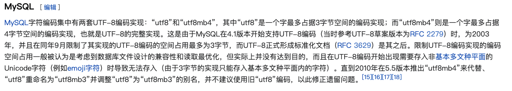

# MySQL

## 目录

- [MySQL](#mysql)
  - [目录](#目录)
  - [MySQL 基础结构](#mysql-基础结构)
  - [MySQL 存储引擎架构了解吗？](#mysql-存储引擎架构了解吗)
  - [字符集](#字符集)

## MySQL 基础结构

执行一条 `SQL`，在 `MySQL` 的过程？

- 连接器： 身份认证和权限相关(登录 MySQL 的时候)。
- 查询缓存： 执行查询语句的时候，会先查询缓存（MySQL 8.0 版本后移除，因为这个功能不太实用）。
- 分析器： 没有命中缓存的话，SQL 语句就会经过分析器，分析器说白了就是要先看你的 SQL 语句要干嘛，再检查你的 SQL 语句语法是否正确。
- 优化器： 按照 MySQL 认为最优的方案去执行。
- 执行器： 执行语句，然后从存储引擎返回数据。 执行语句之前会先判断是否有权限，如果没有权限的话，就会报错。
- 插件式存储引擎 ： 主要负责数据的存储和读取，采用的是插件式架构，支持 InnoDB、MyISAM、Memory 等多种存储引擎。

## MySQL 存储引擎架构了解吗？

MySQL 存储引擎采用的是插件式架构，支持多种存储引擎，我们甚至可以为不同的数据库表设置不同的存储引擎以适应不同场景的需要。存储引擎是基于表的，而不是数据库。

并且，你还可以根据 MySQL 定义的存储引擎实现标准接口来编写一个属于自己的存储引擎。这些非官方提供的存储引擎可以称为第三方存储引擎，区别于官方存储引擎。像目前最常用的 InnoDB 其实刚开始就是一个第三方存储引擎，后面由于过于优秀，其被 Oracle 直接收购了。

## 字符集

`MySQL` 字符编码集中有两套 `UTF-8` 编码实现：`utf8` 和 `utf8mb4`。

如果使用 `utf8` 的话，存储 `emoji` 符号和一些比较复杂的汉字、繁体字就会出错。

常见的字符集有 ASCII、GB2312、GBK、UTF-8......。

不同的字符集的主要**区别**在于：

- 可以表示的字符范围
- 编码方式

`MySQL` 字符编码集中有两套 `UTF-8` 编码实现：

- `utf8` ： utf8编码只支持1-3个字节 。 在 utf8 编码中，中文是占 3 个字节，其他数字、英文、符号占一个字节。但 emoji 符号占 4 个字节，一些较复杂的文字、繁体字也是 4 个字节。
- `utf8mb4` ： UTF-8 的完整实现，正版！最多支持使用 4 个字节表示字符，因此，可以用来存储 emoji 符号。

为什么有两套 UTF-8 编码实现呢？ 原因如下：

因此，如果你需要存储emoji类型的数据或者一些比较复杂的文字、繁体字到 MySQL 数据库的话，数据库的编码一定要指定为utf8mb4 而不是utf8 ，要不然存储的时候就会报错了。

