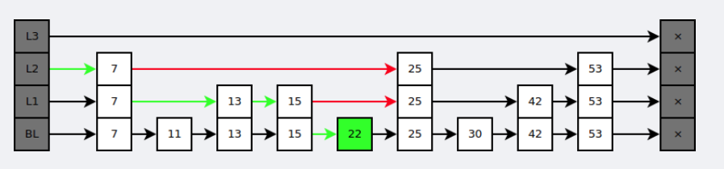

## 简介

`Redis` 是速度非常快的非关系型（`NoSQL`）内存键值数据库，可以存储键和五种不同类型的值之间的映射。

键的类型只能为字符串，值支持五种数据类型：字符串(`string`)、列表(`list`)、集合(`set`)、散列表(`hash`)、有序集合(`zset`)。

`Redis` 支持很多特性，例如将内存中的数据持久化到硬盘中，使用复制来扩展读性能，使用分片来扩展写性能。

## 数据类型

| 数据类型	| 可以存储的值	|操作|
| --------- | --- | ------- |
|STRING| 字符串，整数，浮点数	|对整个字符串或者字符串的其中一部分执行操作</br> 对整数和浮点数执行自增或者自减操作|
|LIST|	列表|	从两端压入或者弹出元素 </br> 对单个或者多个元素进行修剪，</br> 只保留一个范围内的元素|
|SET	|无序集合|添加、获取、移除单个元素</br> 检查一个元素是否存在于集合中</br> 计算交集、并集、差集</br> 从集合里面随机获取元素|
|HASH|	包含键值对的无需散列表|	添加、获取、移除单个键值对</br> 获取所有键值对</br> 检查某个键是否存在|
|ZSET|	有序集合|添加、获取、删除元素</br> 根据分值范围或者成员来获取元素</br> 计算一个键的排名|

### 字典 (TODO)

### 跳跃表 (有序集合)

是有序集合的底层实现之一。

跳跃表是基于多指针有序链表实现的，可以看成多个有序链表。


在查找时，从上层指针开始查找，找到对应的区间之后再到下一层去查找。下图演示了查找 22 的过程。



与红黑树等平衡树相比，跳跃表具有以下优点：

- 插入速度非常快速，因为不需要进行旋转等操作来维护平衡性；
- 更容易实现；
- 支持无锁操作。

## 过期时间

Redis 可以为每个键设置过期时间，当键过期时，会自动删除该键。

对于**散列表**这种容器，只能为整个键设置过期时间（整个散列表），而**不能**为键里面的单个元素设置过期时间。

## 淘汰策略

可以设置内存最大使用量，当内存使用量超出时，会施行数据淘汰策略。

| 策略 | 描述 |
| :--: | :--: |
| noeviction | 到达最大的内存，新的键值对将不会被保存。当数据库使用复制时，这被用于主库|
| volatile-lru | 从已设置过期时间的数据集中挑选**最近最少使用**的数据淘汰 |
| volatile-ttl | 从已设置过期时间的数据集中挑选将要过期的数据淘汰 |
|volatile-random | 从已设置过期时间的数据集中任意选择数据淘汰 |
| allkeys-lru | 从所有数据集中挑选**最近最少使用**的数据淘汰 |
| allkeys-random | 从所有数据集中任意选择数据进行淘汰 |
| 以下是 4.0 新增 |  |
| volatile-lfu | 将**最少使用次数**的键与“到期”字段设置为 true。 |
| allkeys-lfu | 保留经常使用的钥匙；删除**最少使用次数**的（LFU）键 |

如果没有与先决条件相匹配的 `keys` (即已经设置过期时间的 `keys`)，则策略 volatile-lru, volatile-lfu, volatile-random, and volatile-ttl 的行为就会像 noeviction。

> https://redis.io/docs/manual/eviction/

使用 `Redis` 缓存数据时，为了提高缓存命中率，需要保证缓存数据都是热点数据。可以将内存最大使用量设置为热点数据占用的内存量，然后启用 `allkeys-lru` 淘汰策略，将最近最少使用的数据淘汰。

这里要**注意** `LRU` 和 `LFU` 的区别：

> Let's consider a constant stream of cache requests with a cache capacity of 3, see below:
> 
> ```
> A, B, C, A, A, A, A, A, A, A, A, A, A, A, B, C, D
> ```
> 
> If we just consider a **Least Recently Used (LRU)** cache with a HashMap + doubly linked list implementation with O(1) > eviction time and O(1) load time, we would have the following elements cached while processing the caching requests as > mentioned above.
> 
> ```
> [A]
> [A, B]
> [A, B, C]
> [B, C, A] <- a stream of As keeps A at the head of the list.
> [C, A, B]
> [A, B, C]
> [B, C, D] <- here, we evict A, we can do better! 
> ```
> 
> When you look at this example, you can easily see that we can do better - given the higher expected chance of requesting > an A in the future, we should not evict it even if it was least recently used.
> 
> ```
> A - 12
> B - 2
> C - 2
> D - 1
> ```
> **Least Frequently Used (LFU)** cache takes advantage of this information by keeping track of how many times the cache > request has been used in its eviction algorithm.
> 
> https://stackoverflow.com/a/29225598/15042683

## 数据备份(持久化)与恢复

> https://redis.io/docs/manual/persistence/

### 方式

- `RDB`：以指定时间间隔对数据集进行快照
  - 缺点：
      - 如果系统发生故障，将会丢失最后一次创建快照之后的数据。

      - 如果数据量很大，保存快照的时间会很长。

- `AOF`：将写命令添加到 AOF 文件（`Append Only File`）的末尾。

    使用 AOF 持久化需要设置同步选项，从而确保写命令同步到磁盘文件上的时机。这是因为对文件进行写入并不会马上将内容同步到磁盘上，而是先存储到缓冲区，然后由操作系统决定什么时候同步到磁盘。有以下同步选项：

    | 选项 | 同步频率 |
    | :--: | :--: |
    | always | 每个写命令都同步 |
    | everysec(默认) | 每秒同步一次 |
    | no | 让操作系统来决定何时同步 |

    - `always` 选项会严重减低服务器的性能；
    - `everysec` 选项(默认)比较合适，可以保证系统崩溃时只会丢失一秒左右的数据；
    - `no` ：把你的数据交给操作系统。更快更不安全的方法。通常，Linux 会使用这种配置每30秒刷新一次数据，但这取决于内核的精确调优。

    建议(和**默认**)的策略是每秒 `fsync` 一次（`everysec`）。它既快速又相对安全。 `always` 策略在实践中非常慢，但是它支持组提交，所以如果有多个并行写操作，`Redis` 将尝试执行单个 `fsync` 操作。
    
    随着服务器写请求的增多，AOF 文件会越来越大。Redis 会自动执行 `AOF Rewrite`，重组AOF文件，降低其占用的存储空间。

### 方法

> https://redis.io/docs/manual/persistence/#backing-up-redis-data

- 备份

`RDB`
```shell
redis 127.0.0.1:6379> SAVE 
OK
```

`AOF`

在 `Redis` 配置文件中：

> mac: /usr/local/etc/redis.conf
> 
> linux(ubuntu):  /etc//redis/redis.conf
```
appendonly yes
```

- 恢复

如果需要恢复数据，只需将备份文件 (`dump.rdb`) 移动到 `redis` 安装目录并启动服务即可。获取 `redis` 目录可以使用 `CONFIG` 命令，如下所示：

```shell
redis 127.0.0.1:6379> CONFIG GET dir
1) "dir"
2) "/usr/local/redis/bin"
```

- 官方建议实践：
  - 在服务器中创建 `cron` 作业，在一个目录中创建 RDB 文件的每小时快照，并在另一个目录中创建每日快照。
  - 每次运行 `cron` 脚本时，确保调用 `find` 命令来确保删除太旧的快照: 例如，您可以在最近的48小时内每小时拍摄快照，在一个月或两个月内每天拍摄快照。确保用日期和时间信息命名快照。
  - 每天至少确保传输一次 RDB 快照给你的数据中心外或者至少在运行 `Redis` 实例的物理机器之外的位置（个人注：用于外部保存备份）。

## 事务

一个事务包含了多个命令，服务器在执行事务期间，不会改去执行其它客户端的命令请求。

事务中的多个命令被一次性发送给服务器，而不是一条一条发送，这种方式被称为流水线，它可以减少客户端与服务器之间的网络通信次数从而提升性能。

Redis 最简单的事务实现方式是使用 `MULTI` (标记一个事务块的开始) 和 `EXEC` (执行所有事务块内的命令)命令将事务操作包围起来。(`DISCARD`: 取消事务，放弃执行事务块内的所有命令)

## 什么是缓存雪崩、缓存击穿、缓存穿透？

### 缓存雪崩

**当某一个时刻出现大规模的缓存失效的情况，那么就会导致大量的请求直接打在数据库上面**，导致数据库压力巨大，如果在高并发的情况下，可能瞬间就会导致数据库宕机。这时候如果运维马上又重启数据库，马上又会有新的流量把数据库打死。这就是缓存雪崩。

- 分析：

造成缓存雪崩的关键在于在同一时间大规模的key失效。为什么会出现这个问题呢，有几种可能，第一种可能是Redis宕机，第二种可能是采用了相同的过期时间。搞清楚原因之后，那么有什么解决方案呢？

- 解决方案：

1、在原有的失效时间上加上一个随机值，比如1-5分钟随机。这样就避免了因为采用相同的过期时间导致的缓存雪崩。

如果真的发生了缓存雪崩，有没有什么兜底的措施？

2、使用熔断机制。当流量到达一定的阈值时，就直接返回“系统拥挤”之类的提示，防止过多的请求打在数据库上。至少能保证一部分用户是可以正常使用，其他用户多刷新几次也能得到结果。

3、提高数据库的容灾能力，可以使用分库分表，读写分离的策略。

4、为了防止Redis宕机导致缓存雪崩的问题，可以搭建Redis集群，提高Redis的容灾性。

### 缓存击穿

其实跟缓存雪崩有点类似，缓存雪崩是大规模的key失效，而**缓存击穿是一个热点的Key，有大并发集中对其进行访问，突然间这个Key失效了，导致大并发全部打在数据库上，**导致数据库压力剧增。这种现象就叫做缓存击穿。

- 分析：

关键在于某个热点的key失效了，导致大并发集中打在数据库上。所以要从两个方面解决，第一是否可以考虑热点key不设置过期时间，第二是否可以考虑降低打在数据库上的请求数量。

- 解决方案：

1、上面说过了，如果业务允许的话，对于热点的key可以设置永不过期的key。

2、使用互斥锁。如果缓存失效的情况，只有拿到锁才可以查询数据库，降低了在同一时刻打在数据库上的请求，防止数据库打死。当然这样会导致系统的性能变差。

### 缓存穿透

我们使用Redis大部分情况都是通过Key查询对应的值，假如发送的请求传进来的**key是不存在 Redis 中的，那么就查不到缓存，查不到缓存就会去数据库查询**。假如有大量这样的请求，这些请求像“穿透”了缓存一样直接打在数据库上，这种现象就叫做缓存穿透。

- 分析：

关键在于在Redis查不到key值，这和缓存击穿有根本的区别，区别在于缓存穿透的情况是传进来的key在Redis中是不存在的。假如有黑客传进大量的不存在的key，那么大量的请求打在数据库上是很致命的问题，所以在日常开发中要对参数做好校验，一些非法的参数，不可能存在的key就直接返回错误提示，要对调用方保持这种“不信任”的心态。

- 解决方案：

1、把无效的Key存进Redis中。如果Redis查不到数据，数据库也查不到，我们把这个Key值保存进Redis，设置  **value="null"** ，当下次再通过这个Key查询时就不需要再查询数据库。这种处理方式肯定是有问题的，假如传进来的这个不存在的Key值每次都是随机的，那存进Redis也没有意义。

2、使用**布隆过滤器**。布隆过滤器的作用是某个 key 不存在，那么就一定不存在，它说某个 key 存在，那么很大可能是存在(存在一定的误判率)。于是我们可以在缓存之前再加一层布隆过滤器，在查询的时候先去布隆过滤器查询 key 是否存在，如果不存在就直接返回。
