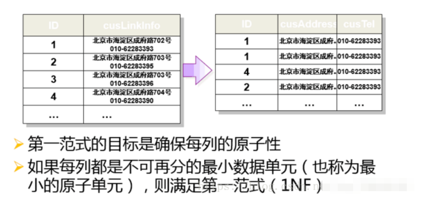
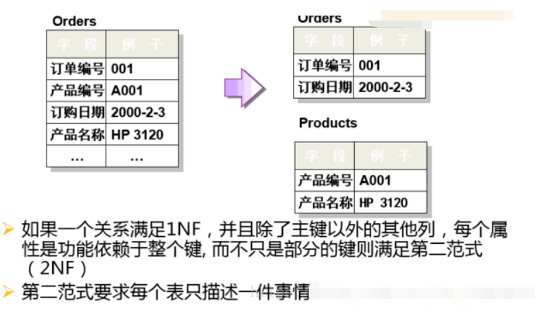
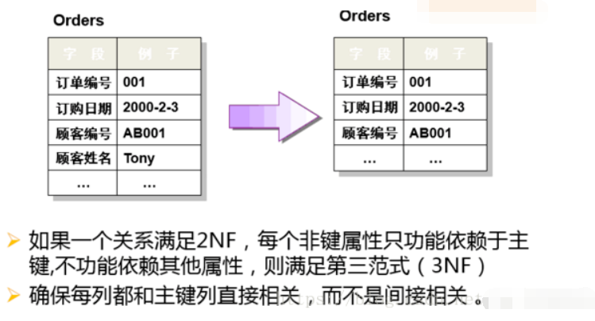

# 基本概念

- [基本概念](#基本概念)
  - [为什么不推荐使用外键](#为什么不推荐使用外键)
  - [什么时候使用外键](#什么时候使用外键)
  - [数据库范式](#数据库范式)
  - [存储过程](#存储过程)
  - [事务](#事务)
  - [数据库设计通常分为哪几步?](#数据库设计通常分为哪几步)

## 为什么不推荐使用外键

来自阿里巴巴手册：

> 【强制】不得使用外键与级联，一切外键概念必须在应用层解决。
>
> 说明: 以学生和成绩的关系为例，学生表中的 student_id 是主键，那么成绩表中的 student_id 则为外键。如果更新学生表中的 student_id，同时触发成绩表中的 student_id 更新，即为级联更新。外键与级联更新适用于单机低并发，不适合分布式、高并发集群; 级联更新是强阻塞，存在数据库更新风暴的风 险; 外键影响数据库的插入速度。

1. 增加了复杂性： a. 每次做DELETE 或者UPDATE都必须考虑外键约束，会导致开发的时候很痛苦, 测试数据极为不方便; b. 外键的主从关系是定的，假如那天需求有变化，数据库中的这个字段根本不需要和其他表有关联的话就会增加很多麻烦。
2. 增加了额外工作： 数据库需要增加维护外键的工作，比如当我们做一些涉及外键字段的增，删，更新操作之后，需要触发相关操作去检查，保证数据的的一致性和正确性，这样会不得不消耗资源；（个人觉得这个不是不用外键的原因，因为即使你不使用外键，你在应用层面也还是要保证的。所以，我觉得这个影响可以忽略不计。）
3. 对分库分表不友好 ：因为分库分表下外键是无法生效的。
4. ...

## 什么时候使用外键

外键的好处：

1. 保证了数据库数据的一致性和完整性；
2. 级联操作方便，减轻了程序代码量；
3. ......

所以说，不要一股脑的就抛弃了外键这个概念，既然它存在就有它存在的道理，如果系统不涉及分库分表，并发量不是很高的情况还是可以考虑使用外键的。

## 数据库范式

第一范式（`1NF`）：数据表中的每一列（每个字段）必须是不可拆分的最小单元，也就是确保每一列的原子性；

第二范式（`2NF`）：满足`1NF`后，要求表中的所有列，都必须依赖于主键，而不能有任何一列与主键没有关系，也就是说一个表只描述一件事情；

第三范式（`3NF`）：必须先满足第二范式（`2NF`），要求：表中的每一列只与主键直接相关而不是间接相关，（表中的每一列只能依赖于主键）；

## 存储过程

我们可以把存储过程看成是一些 SQL 语句的集合，中间加了点逻辑控制语句。**存储过程在业务比较复杂的时候是非常实用的**，比如很多时候我们完成一个操作可能需要写一大串 SQL 语句，这时候我们就可以写有一个存储过程，这样也方便了我们下一次的调用。存储过程一旦调试完成通过后就能稳定运行，另外，**使用存储过程比单纯 SQL 语句执行要快，因为存储过程是预编译过的。**

存储过程在互联网公司应用不多，因为**存储过程难以调试和扩展，而且没有移植性，还会消耗数据库资源。**

## 事务

事务指的是满足 ACID 特性的一组操作，可以通过 Commit 提交一个事务，也可以使用 Rollback 进行回滚。

`ACID`

1. 原子性（Atomicity）
事务被视为不可分割的最小单元，事务的所有操作要么全部提交成功，要么全部失败回滚。
回滚可以用回滚日志（Undo Log）来实现，回滚日志记录着事务所执行的修改操作，在回滚时反向执行这些修改操作即可。

2. 一致性（Consistency）
数据库在事务执行前后都保持一致性状态。在一致性状态下，所有事务对同一个数据的读取结果都是相同的。

3. 隔离性（Isolation）
一个事务所做的修改在最终提交以前，对其它事务是不可见的。

4. 持久性（Durability）
一旦事务提交，则其所做的修改将会永远保存到数据库中。即使系统发生崩溃，事务执行的结果也不能丢失。

系统发生崩溃可以用重做日志（Redo Log）进行恢复，从而实现持久性。与回滚日志记录数据的逻辑修改不同，重做日志记录的是数据页的物理修改。

**只有保证了事务的持久性、原子性、隔离性之后，一致性才能得到保障。也就是说 A、I、D 是手段，C 是目的！**

## 数据库设计通常分为哪几步?
1. 需求分析 : 分析用户的需求，包括数据、功能和性能需求。
2. 概念结构设计 : 主要采用 E-R 模型进行设计，包括画 E-R 图。
3. 逻辑结构设计 : 通过将 E-R 图转换成表，实现从 E-R 模型到关系模型的转换。
4. 物理结构设计 : 主要是为所设计的数据库选择合适的存储结构和存取路径。
5. 数据库实施 : 包括编程、测试和试运行
6. 数据库的运行和维护 : 系统的运行与数据库的日常维护。
