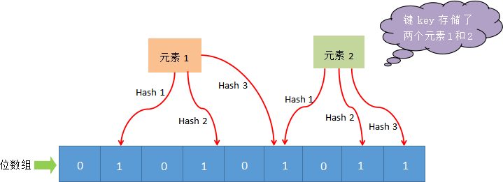

# 布隆过滤器（Bloom Filter）

布隆过滤器（Bloom Filter）是 Redis 4.0 版本提供的新功能，它被作为插件加载到 Redis 服务器中，给 Redis 提供强大的去重功能。

下面举两个简单的例子：
1) 示例：
百度爬虫系统每天会面临海量的 URL 数据，我们希望它每次只爬取最新的页面，而对于没有更新过的页面则不爬取，因策爬虫系统必须对已经抓取过的 URL 去重，否则会严重影响执行效率。但是如果使用一个 set（集合）去装载这些 URL 地址，那么将造成资源空间的严重浪费。
2) 示例：
垃圾邮件过滤功能也采用了布隆过滤器。虽然在过滤的过程中，布隆过滤器会存在一定的误判，但比较于牺牲宝贵的性能和空间来说，这一点误判是微不足道的。

## 工作原理

布隆过滤器（Bloom Filter）是一个高空间利用率的概率性数据结构，由二进制向量（即位数组）和一系列随机映射函数（即哈希函数）两部分组成。

布隆过滤器使用 `exists()` 来判断某个元素是否存在于自身结构中。当布隆过滤器判定某个值存在时，其实这个值只是有可能存在；当它说某个值不存在时，那这个值肯定不存在，这个误判概率大约在 1% 左右。

1) 工作流程-添加元素
    布隆过滤器主要由位数组和一系列 hash 函数构成，其中位数组的初始状态都为 0。

    下面对布隆过滤器工作流程做简单描述，如下图所示：

    

    当使用布隆过滤器添加 key 时，会使用不同的 hash 函数对 key 存储的元素值进行哈希计算，从而会得到多个哈希值。根据哈希值计算出一个整数索引值，将该索引值与位数组长度做取余运算，最终得到一个位数组位置，并将该位置的值变为 1。每个 hash 函数都会计算出一个不同的位置，然后把数组中与之对应的位置变为 1。通过上述过程就完成了元素添加(`add`)操作。

2) 工作流程-判定元素是否存在

    当我们需要判断一个元素是否存时，其流程如下：首先对给定元素再次执行哈希计算，得到与添加元素时相同的位数组位置，判断所得位置是否都为 1，如果其中有一个为 0，那么说明元素不存在，若都为 1，则说明元素有可能存在。

3) 为什么是可能“存在”

    您可能会问，为什么是有可能存在？其实原因很简单，那些被置为 1 的位置也可能是由于其他元素的操作而改变的。比如，元素1 和 元素2，这两个元素同时将一个位置变为了 1（图上所示）。在这种情况下，我们就不能判定“元素 1”一定存在，这是布隆过滤器存在误判的根本原因。

另外，一般情况下不能从布隆过滤器中删除元素。我们很容易想到把位数组变成整数数组，每插入一个元素相应的计数器加1, 这样删除元素时将计数器减掉就可以了。然而要保证安全地删除元素并非如此简单。首先我们必须保证删除的元素的确在布隆过滤器里面。这一点单凭这个过滤器是无法保证的。另外计数器回绕也会造成问题。

> https://zh.wikipedia.org/zh-hans/%E5%B8%83%E9%9A%86%E8%BF%87%E6%BB%A4%E5%99%A8

Golang 实现：https://github.com/bits-and-blooms/bloom

> 扩展：
> 布谷过滤器
> https://www.cnblogs.com/zhaodongge/p/15067657.html
> https://github.com/seiflotfy/cuckoofilter
